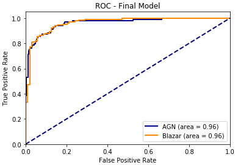

### Deep Learning Blazar Classification based on Multi-frequency Spectral Energy Distribution Data
Project from September - 2019 to December - 2019 

Repository containing code for the paper: [Deep Learning Blazar Classification based on Multi-frequency Spectral Energy Distribution Data] ](https://arxiv.org/abs/2012.15340)

# ROC Statistics

#Map of Attention

